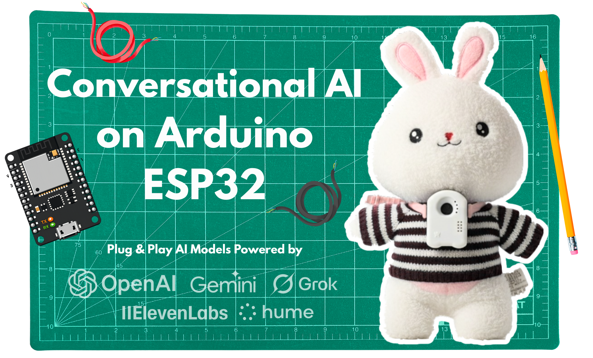

English | [中文](README.zh.md)

<div align="center">

  <a href="https://daacoo.com"><picture>
    <source media="(prefers-color-scheme: dark)" srcset="assets/darkelato.png">
    <source media="(prefers-color-scheme: light)" srcset="assets/lightelato.png">
    
  </picture></a>
  
<div style="display:flex; flex-direction:row; align-items:center; flex-wrap:wrap; justify-content:center;">
  <a style="display:inline-flex;" href="https://cookbook.openai.com/examples/voice_solutions/running_realtime_api_speech_on_esp32_arduino_edge_runtime_daacoo"></a>  
  <a style="display:inline-flex;" href="https://www.daacoo.com/docs"></a>
 
  
 
</a>

<br />
</div>

## News
- **Apr 17 2026:** Create a Global Devices/Toys network with Cloudflare Voice Agents and Durable Objects. Cloudflare's Workers AI provides Deepgram STT/TTS natively so all you need to bring is an LLM API Key to create a scalable, low-latency voice AI pipeline.
- **Apr 15 2026:** You can launch over 100+ STT, LLM, TTS voice pipeline systems with a FastAPI server with Pipecat!
- **Mar 14 2026:** Elato just launched Local AI Toys on Pi Day.🎉🎉 Your ESP32 devices can now support local AI models and voice generation with frontier Local LLMs and TTS models like Qwen, Mistral, and more with MLX. Check it out [here](https://github.com/yuanzhongqiao/deeptoys). 

# 👾 DaaCoo AI: Realtime Voice AI Models on Arduino ESP32

Realtime AI Speech powered by 100+ Voice AI models on ESP32, with Secure WebSockets & Edge Functions for >20-minute uninterrupted conversations globally.

- [🚀 Quick Start](https://www.daacoo.com/docs/quickstart)
- [Build with PlatformIO](https://www.daacoo.com/docs/platformio)
- [Build on Arduino IDE](https://www.daacoo.com/docs/arduino)
- [Deploy globally](https://www.daacoo.com/docs/blog/deploying-globally)
- [🤖🤖🤖 Deploy multiple devices](https://www.daacoo.com/docs/blog/multiple-devices)


# 🤖 DaaCoo AI — Real-time Voice AI on ESP32 Ecosystem

This is a **remarkably complete** edge voice AI project. Let me break down the core highlights:

---

## 🎯 TL;DR

> **With a single ESP32 (a ~$3 chip) + WiFi, you get a globally connected voice AI toy/device powered by OpenAI/Gemini/Grok/ElevenLabs/Hume — end-to-end latency under 2 seconds.**

---

## 📐 Three-Layer Architecture

| Layer | Tech | Role |
|-------|------|------|
| 🖥️ **Frontend** | Next.js (Vercel) | Create AI agents, chat history, volume/pitch control, device management |
| ⚡ **Edge** | Deno Edge / Cloudflare Workers | WebSocket bridge + LLM/TTS/STT calls + VAD turn detection |
| 📟 **Device** | ESP32-S3 (PlatformIO) | Record → Opus encode → Upload via WebSocket → Play response |

```
📱 Phone/Web  ←WebRTC/WS→  ☁️ Deno/CF Edge  ←WSS→  📟 ESP32
   Next.js                    LLM+TTS+STT              Audio I/O
```

---

## 🔥 Top 6 Things That Stand Out

| # | Highlight | Why It Matters |
|---|-----------|----------------|
| 1️⃣ | **No PSRAM Required** | ESP32s usually need external PSRAM to run AI — this is optimized to run without it → ultra-low cost |
| 2️⃣ | **100+ Model Support** | Not locked to one API — OpenAI/Gemini/Grok/ElevenLabs/Hume, switch freely |
| 3️⃣ | **Opus @ 12kbps** | High-quality voice at extremely low bandwidth — ideal for global deployment |
| 4️⃣ | **20 Min Uninterrupted Chat** | WebSocket persistent connection + edge functions, far exceeding typical IoT chat duration |
| 5️⃣ | **Global Edge Deployment** | Deno Edge / Cloudflare Workers ensure low latency — not stuck in a single data center |
| 6️⃣ | **Full Product-Readiness** | Not a demo — OTA updates, captive portal WiFi setup, factory reset, user auth… |

---

## 📊 Key Metrics at a Glance

| Metric | Value |
|--------|-------|
| 🌍 Global Latency | **< 2 seconds** (RTT) |
| 🎙️ Audio Codec | Opus @ **12 kbps** / 24kHz |
| ⏱️ Max Conversation | **~17–20 minutes** continuous |
| 🔌 Cold Start | 3–4 seconds |
| 💰 Hardware Cost | ESP32-S3 ≈ **$3–5** |

---

## ⚠️ Current Limitations (Being Honest)

| Limitation | Detail |
|------------|--------|
| 🚫 Voice Interruption | Not yet supported on ESP32 (supported on OpenAI side) |
| ⏰ Wall Clock Limit | Edge functions have timeouts — connection drops after timeout |
| 🧊 Cold Start | 3–4 second delay on first connection |
| 📡 Cloud LLM Dependent | No offline capability (though local MLX option exists) |

---

## 🆚 Comparison with Alternatives

| Solution | Hardware | Latency | Cost | Offline |
|----------|----------|---------|------|---------|
| **DaaCoo AI** | ESP32-S3 | <2s | $5 + API | ❌ |
| Raspberry Pi + Local LLM | RPi 4/5 | 1–3s | $50+ | ✅ |
| Home Assistant Voice | Any | 2–5s | Free | ✅ |
| Cloudflare Voice Agents | No HW | <1s | Pay-per-use | ❌ |

---

## 💡 My Take

The **real value** of this project isn't the tech itself (voice AI pipelines already exist) — it's that:

> **It bridges the gap between "cloud-grade voice AI" and "ultra-minimal edge hardware" with a turnkey solution.**

For anyone building:
- 🎮 **AI toys / robots**
- 🗣️ **Voice interaction hardware products**
- 🏠 **Smart home voice nodes**
- 🎓 **Edge AI educational projects**

This is arguably the **lowest-barrier, most feature-complete** solution available right now.

---

**⭐ Go give it a Star on GitHub!** If this project keeps evolving, it could become the "standard answer" for ESP32 voice AI.
 
## License

This project is licensed under the MIT License - see the [LICENSE](LICENSE) file for details.

**Check out our hardware offerings at [DaaCoo AI Products](https://www.daacoo.com/). If you find this project interesting or useful, support us by starring this project on GitHub. ⭐**
